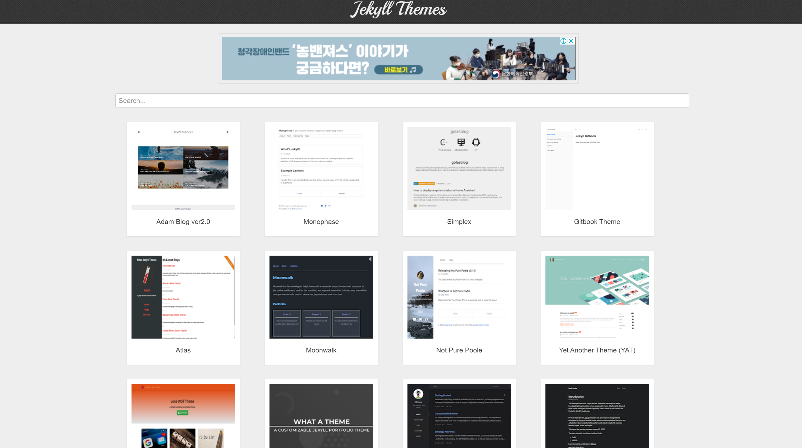

# [xeoxxn.github.io](https://xeoxxn.github.io/)


## Build 과정

### 1. Repository 생성

Github에서 \<username>.github.io 이름의 Repository 생성

### 2. Local-Remote Repository 연동

1. Remote Repository의 주소를 복사한 후

2. `git clone <복사한 Remote Repository의 주소> <path>`로 clone

3. `git commit -m "<commit message>"`로 커밋 남기기

4. `git branch -M main`으로 현재 branch의 이름을 main으로 변경 ( 원래부터 main 일 시 변경 필요 X)

5. `git status`로 현재 상태 확인 후 `git add .`로 변경파일 추가

6. `git push origin main`으로 main에 로컬 변경사항 push

### 3. Jekyll 설치

[Windows용 Jekyll 가이드 참조](https://jekyllrb-ko.github.io/docs/installation/windows/)

[Windows용 Ruby + Devkit](https://rubyinstaller.org/downloads/)

위의 링크를 통해 Ruby 설치

Jekyll과 Bundler를 설치

`gem install jekyll bundler`

Jekyll이 올바르게 설치되었는지 확인

`jekyll -v`

### 4. Jekyll 사이트 생성

현재 디렉토리(.)에 Jekyll을 설치

`jekyll new . --force`

Jekyll 시작하기

`bundle exec jekyll serve` 을 실행 후,

localhost:4000 접속

LoadError 발생 시 webrick 파일 설치
`cannot load such file -- webrick`
-> `bundle add webrick`

### 5. 테마 적용하기

1. [Jekyll Themes](http://jekyllthemes.org/)에서 원하는 테마 선택



2. [원하는 테마](https://github.com/kssim/ap)를 git clone해서 로컬에 받아오기

3. 테마 파일들을 로컬 저장소에 반영하기

- 이때, 의존성을 감안하여 \_posts를 제외하고 테마를 덮어쓰기

### 6. Customize

블로그 포스팅은 **\_posts** 폴더에서 진행

\_post에 **YYYY-MM-DD-TITLE.md** 형태로 새로운 문서를 작성


```

---
layout: post
title: "제목"
info: "설명"
tech: "언어"
type: "[type]"
---

```

위와 같은 형식으로 Post 문서를 작성

Markdown 형식을 통해 내용 작성

- **홈 화면**


- **포트폴리오**


- **MarkDown_Practice 페이지**


### 7. 댓글 기능 추가

1. [Disqus](https://disqus.com) 가입

2. "I want to install Disqus on my site" 선택

3. 사이트 정보 입력 (이때, **Website Name 기억해두기**)

4. Platform 중 **Jekyll** 선택

5. Install Instruction을 읽어본 후 **Configure**를 눌러 다음을 진행

6. **Website URL**에 사이트 주소(https://xeoxxn.github.io/) 입력 후 Next로 이동

7. Comment 정책 선택

8. **Complete Setup**을 눌러 설정 마무리

9. \_config.yml에 다음과 같은 key-value 추가

```

# Custom vars

version: 1.1.0
google_analytics_id: #UA-XXXX-Y
comment:
provider: "disqus"
disqus:
shortname: "xeoxxn"
```

10. \_layout/post.html을 페이지에 맞게 수정

```

<h2>Comment</h2>
<div id="disqus_thread"></div>
<script>
/**

* RECOMMENDED CONFIGURATION VARIABLES: EDIT AND UNCOMMENT THE SECTION BELOW TO INSERT DYNAMIC VALUES FROM YOUR PLATFORM OR CMS.

* LEARN WHY DEFINING THESE VARIABLES IS IMPORTANT: https://disqus.com/admin/universalcode/#configuration-variables */

var disqus_config = function () {

this.page.url = PAGE_URL; // Replace PAGE_URL with your page's canonical URL variable

this.page.identifier = PAGE_IDENTIFIER; // Replace PAGE_IDENTIFIER with your page's unique identifier variable

};

(function() { // DON'T EDIT BELOW THIS LINE

var d = document, s = d.createElement('script');

s.src = 'https://sinji2102.disqus.com/embed.js';

s.setAttribute('data-timestamp', +new Date());

(d.head || d.body).appendChild(s);

})();

</script>

<noscript>Please enable JavaScript to view the <a href="https://disqus.com/?ref_noscript">comments powered by Disqus.</a></noscript>



```

11. 댓글을 허용하고 싶은 곳에 `comments: true`로 지정

### 8. favicon 수정하기

[ICON](https://icon-icons.com/ko/) 사이트에서 원하는 이미지를 다운받은 후
`favicon.ico` 의 이미지를 교체해주면 바뀌는 것을 확인할 수 있다.


### 9. 구글 애널리틱스 설정하기

- **_초기 설정_**
  [Google Analytics](https://analytics.google.com/analytics/web/provision/?hl=ko&pli=1#/provision) 계정을 먼저 생성한다.
  측정 시작 버튼 &rarr; 계정 이름 생성 &rarr; 속성 설정 &rarr; 비즈니스 정보 입력
- **_애널리틱스 데이터 스트림 설정_**
  웹으로 설정
  https, 내 github 주소, 스트림 이름을 입력하고 스트림 만들기 선택

  측정 아이디 복사 &rarr; \_config.yml에 아래와 같이 추가

  

- **_적용된 것 확인하기_**
  배포 후, 약간 기다리면 애널리틱스 대시보드에서 카운팅 되는 것을 확인할 수 있다.
  
